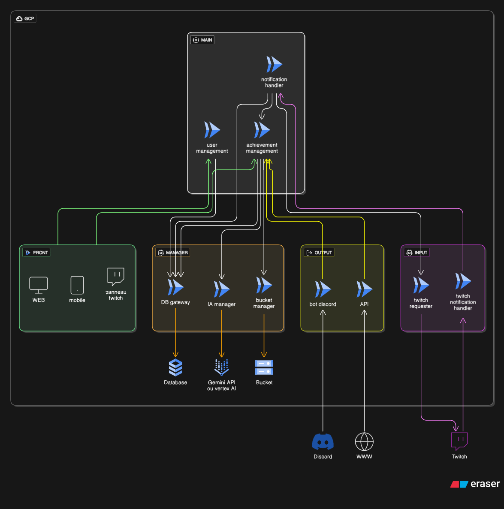
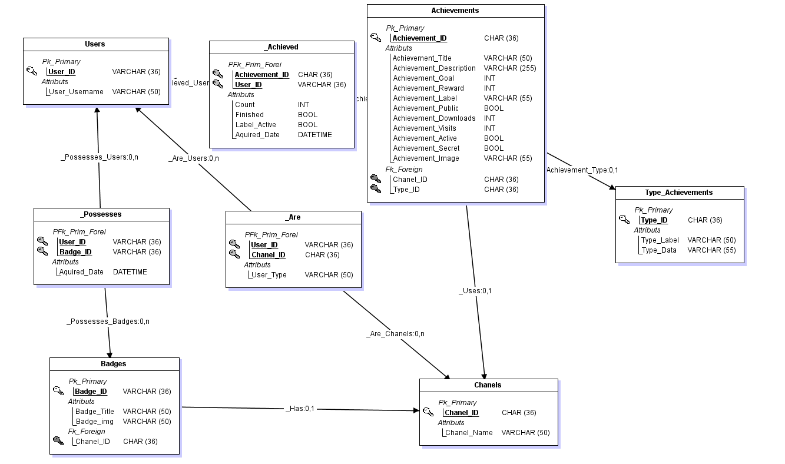

# StreamQuest - Extension Twitch Interactive et Gamifiée

## 🌍 Languages / Langues
- 🇫🇷 **Français** (actuel)
- 🇬🇧 [English](README.md)

---

## 🎯 Présentation du Projet

Ce projet présente le développement d'une **extension Twitch interactive et gamifiée** qui introduit un système de succès/achievements pour les viewers, visant à augmenter l'engagement et la fidélisation des communautés de streamers.

## 🚀 Concept Principal

### Système de Gamification
- **Succès déblocables** basés sur les actions des viewers :
  - Temps de visionnage
  - Points de chaîne dépensés
  - Interactions spécifiques (ex: dire "bonjour" dans le chat)
  - Succès cachés à découvrir
- **Classement des spectateurs** (leaderboard) affichable sur l'application
- **Badges exclusifs** pour les spectateurs les plus investis

### Création de Succès
- **Mode simple** : création facile pour les streamers
- **Mode avancé** : outils développeur pour des succès complexes
- **Suggestions communautaires** pour enrichir le catalogue

## 🛠️ Fonctionnalités Annexes

### 🌐 Plateformes Multiples
- **Extension Twitch** (interface principale)
- **Interface web/mobile** pour configuration et suivi
- **Bot Discord** connecté (notifications, rappels)

### 📚 Bibliothèque Publique
- **Succès réutilisables** entre streamers
- **API publique** pour développeurs externes
- **Intégration** avec applications tierces

### 🤖 Intelligence Artificielle
- Génération automatique de titres/descriptions de succès
- Proposition de succès pertinents selon la chaîne
- Analyse des messages pour suggestions personnalisées

## 💻 Technologies et Compétences Mobilisées

### Cloud Computing
- **Google Cloud Platform (GCP)** pour le déploiement
- **Cloud Run** pour l'orchestration de microservices serverless
- CI/CD, monitoring, scalabilité automatique

### Développement Frontend
- **React** pour l'application web
- **Capacitor** pour l'application web mobile (iOS et Android)
- Expérience multi-support (Twitch + Mobile + Discord)

### Intelligence Artificielle
- Génération automatique de succès
- Analyse comportementale des viewers

### Programmation & API
- **TypeScript** pour la fiabilité et maintenabilité
- Intégration avec l'**API Twitch**

## 🎮 Exemples d'Utilisation

### Cas Concrets
- **Streamer A** : Succès "Fidèle du matin" → dire "bonjour" 3 jours consécutifs
- **Streamer B** : Succès caché "Dépenseur fou" → dépenser 5000 points de chaîne
- **Viewer** : Badge "100 heures regardées" dans le classement public
- **Bot Discord** : "GG @User123, tu viens de débloquer le succès *Fan absolu* !"

## 🎯 Motivations

- Projet **innovant** et proche de nos centres d'intérêt
- Valorisation de la **gamification** comme levier d'engagement
- Démonstration de compétences techniques (Cloud + Mobile + API + IA)
- Potentiel d'adoption réelle par la communauté streaming

## 🏗️ Architecture du Projet

### Diagramme d'Architecture

*Ajoutez votre diagramme d'architecture dans le dossier `docs/` avec le nom `architecture.png`*

### Composants du Projet & Avancement

Le projet **StreamQuest** est structuré en microservices déployés sur **Google Cloud Platform** avec **Cloud Run** :

#### Statut Global

#### 🔗 Services Core
| Service | Description | Issues | PRs | Statut |
|---------|-------------|--------|-----|--------|
| [twitch-event-listener](https://github.com/projet-ccm2/twitch-event-listener) | *Écoute les événements Twitch en temps réel* (messages chat, abonnements, dons) |  |  |  |
| [twitch-requester](https://github.com/projet-ccm2/twitch-requester) | *Interface avec l'API Twitch* pour récupérer données streamers et viewers |  |  |  |
| [API](https://github.com/projet-ccm2/API) | *API Gateway central* exposant les endpoints RESTful pour tous les clients |  |  |  |

#### 🎯 Services Métier
| Service | Description | Issues | PRs | Statut |
|---------|-------------|--------|-----|--------|
| [achievement-management](https://github.com/projet-ccm2/achievement-management) | *Gestion des succès* : création, validation, attribution et progression |  |  |  |
| [user-management](https://github.com/projet-ccm2/user-management) | *Gestion des utilisateurs* : profils, authentification, autorisations |  |  |  |
| [notification-handler](https://github.com/projet-ccm2/notification-handler) | *Système de notifications* multi-canal (Twitch, Discord, mobile) |  |  |  |

#### 🤖 Services Support
| Service | Description | Issues | PRs | Statut |
|---------|-------------|--------|-----|--------|
| [IA-manager](https://github.com/projet-ccm2/IA-manager) | *Intelligence Artificielle* : génération automatique de succès et analyse comportementale |  |  |  |
| [DB-gateway](https://github.com/projet-ccm2/DB-gateway) | *Passerelle base de données* : opérations CRUD sécurisées et cohérentes |  |  |  |
| [bucket-manager](https://github.com/projet-ccm2/bucket-manager) | *Gestion des fichiers* : stockage images, configurations, ressources statiques |  |  |  |

#### 🛠️ Infrastructure & DevOps
| Service | Description | Issues | PRs | Statut |
|---------|-------------|--------|-----|--------|
| [shared-workflows](https://github.com/projet-ccm2/shared-workflows) | *Workflows GitHub Actions* : pipelines CI/CD réutilisables et scripts d'automatisation |  |  |  |
| [terraformInfra](https://github.com/projet-ccm2/terraformInfra) | *Infrastructure as Code* : configurations Terraform pour déploiement GCP et gestion des ressources |  |  |  |

#### 🎨 Frontend & Applications
| Service | Description | Issues | PRs | Statut |
|---------|-------------|--------|-----|--------|
| [front](https://github.com/projet-ccm2/front) | *Application frontend* : interface web React pour streamers et viewers pour gérer les succès, avec Capacitor pour l'application web mobile |  |  |  |
| [bot-discord](https://github.com/projet-ccm2/bot-discord) | *Bot Discord* : notifications automatisées et intégration de gestion communautaire |  |  |  |

### diagramme de donnée

### Liens Rapides
- 📋 [Toutes les Issues](https://github.com/orgs/projet-ccm2/issues)
- 🔄 [Toutes les Pull Requests](https://github.com/orgs/projet-ccm2/pulls)
- 📈 [Tableau de Bord](https://github.com/orgs/projet-ccm2/projects)

## 📋 Structure du Projet

Ce repository d'organisation contient :
- Documentation du projet
- Ressources de présentation
- Liens vers les différents composants du système

---

*Projet développé dans le cadre d'une formation intégrant Cloud Computing, Mobility et IA*